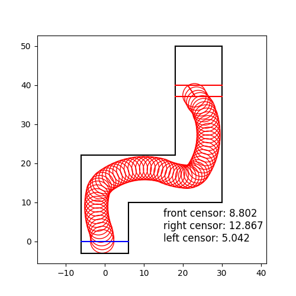

# 採用規則

## 更新函數

$$Q(s(n+1), a(n+1)) \leftarrow Q(s(n), a(n)) + \alpha[r(n+1) + \gamma \max \limits_{a} Q(s(n+1))-Q(s(n),a(n))]$$

##  $\epsilon$-greedy策略

* (1-$\epsilon$)的機率採用動作$a=arg\max\limits_{a}Q_{t}(s, a)$
* $\epsilon$的機率**隨機**採用其他action

## q-table

|   state\angle    | -40° | -30° | -20° | -10° | 0°  | +10° | +20° | +30° | +40° |
|   :---------:    | ---- | ---- | ---- | ---- | --- | ---- | ---- | ---- | ---- |
|   close, right   |      |      |      |      |     |      |      |      |      |
|   close, middle  |      |      |      |      |     |      |      |      |      |
|    close, left   |      |      |      |      |     |      |      |      |      |
|    far, right    |      |      |      |      |     |      |      |      |      |
|    far, middle   |      |      |      |      |     |      |      |      |      |
|     far, left    |      |      |      |      |     |      |      |      |      |

 
## 獎勵規則

|   條件\回饋    |  正回饋  |  負回饋  |
|  :---------:   |  :----:  |  :----:  |
| 近, 右寬, 左彎 |          | &#10004; |
| 近, 右寬, 直行 |          | &#10004; |
| 近, 右寬, 右彎 | &#10004; |          |
| 近, 左寬, 右彎 |          | &#10004; |
| 近, 左寬, 直行 |          | &#10004; |
| 近, 左寬, 左彎 | &#10004; |          |
| 遠, 右寬, 左彎 |          | &#10004; |
| 遠, 右寬, 直行 |          | &#10004; |
| 遠, 右寬, 右彎 | &#10004; |          |
| 遠, 左寬, 右彎 |          | &#10004; |
| 遠, 左寬, 直行 |          | &#10004; |
| 遠, 左寬, 左彎 | &#10004; |          |

## 模糊函數

$$ \begin{cases} 2 \leq  \text{right} - \text {left} , & \text {右寬} \\ -2 \leq \text{right} - \text {left} \leq 2, & \text{中間}  \\  -2 \leq  \text{right} - \text {left}, & \text{左寬}\end{cases}$$

$$ \begin{cases} 7 \lt  \text{right} - \text {left} , & \text {遠} \\ \text {front distance} \leq 7, & \text{近} \end{cases}$$

## 注意事項

* 實際上，獎勵函數和模糊函數的規則應該是還可以再調的，但因為剛好結果跑出來了，所以我就直接當作成功了（運氣也是實力的一環嘛）。

> [!NOTE]可精進之處
> 1. 可以把方向盤的角度再分的細一點，畢竟只有共81個度數，其實不多
> 2. 這其實是接續1.部分。度數如果多一點的話，就可以把獎勵規則再弄的細緻一點
> 3. 遠近距離也可以再調得更細一點
> 4. 因為題目主要要求做的是q-learning，所以程式著重在q-learning的部分，模糊函數的部分站比較少，所以也是可以將模糊函數弄得更好的

## 成功圖片

酷酷的成功圖片

但不得不說，其實結果還蠻抖的，所以也純屬僥倖